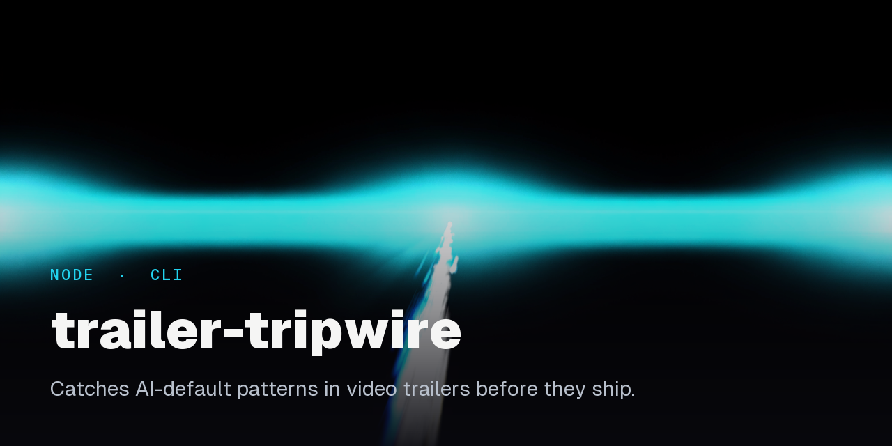
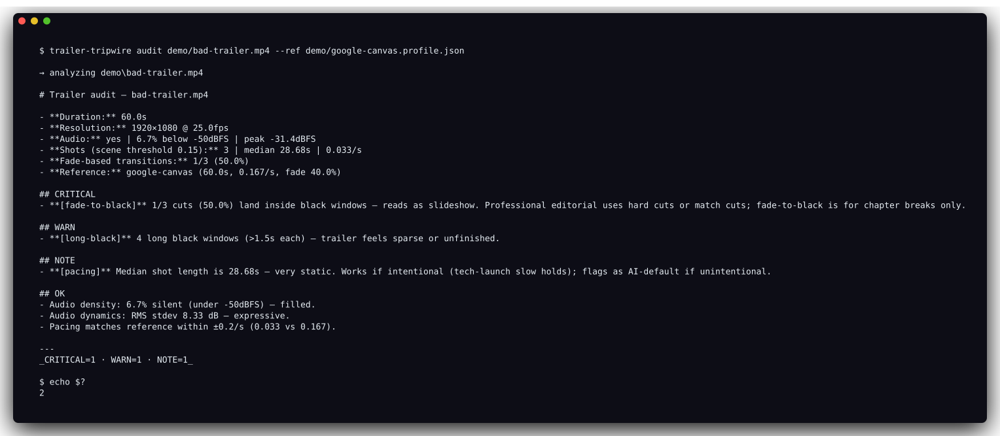

<p align="center"></p>

# trailer-tripwire

  

Catch AI-default patterns in video trailers before they ship. A pattern checker, not a taste checker.



Auditing a real AI-slop sizzle reel (the one described in *Why this exists* below) against the Google Canvas launch film as a reference. Exit code 2, commit blocked. Regenerate with `bash demo/regen.sh`.

---

## Why this exists

I made an AI-generated sizzle trailer for my game studio. It was bad in a specific way: fade-to-black between every beat, procedural Web Audio drone, mixed fonts, sci-fi HUD cruft, one long static shot that never changed. Every choice was the stock default for "indie sizzle reel." Defaults stacked on defaults read as AI because they are.

I couldn't fix it by iterating. More generations produce more defaults. So instead, I built a tripwire that checks for the *measurable* tells (the things I can count with ffmpeg) and blocks a trailer from shipping if they're above threshold.

It won't tell you if your trailer is good. It will tell you if it has the obvious stink of AI slop.

---

## What it measures

Measurable pattern tells, derived empirically by comparing an AI-generated trailer against three human-made corporate launch videos (Google Canvas, Google Gemini era, NVIDIA OpenClaw). Thresholds live in `src/audit.mjs` as plain `if` branches.

| Check | Severity | Threshold | What it catches |
|---|---|---|---|
| **Fade-to-black fraction** | CRITICAL / WARN | >= 40% / >= 20% of cuts | Slideshow tell. AI loves fade-between-beats; human editors use hard cuts and match cuts. Needs >= 3 detected shots to fire. |
| **Audio RMS stdev** | CRITICAL / WARN | < 3 dB / < 6 dB | Procedural-drone tell. Composed music swings 8-15 dB over its run; drones stay flat. |
| **Long black windows** | WARN | > 2 windows longer than 1.5s | Sparse, unfinished, or padded. |
| **Audio peak** | WARN | > -1 dBFS | Clipping risk. Streaming platforms target a -1 dBTP true-peak ceiling. |
| **Median shot length** | WARN / NOTE | < 0.4s (WARN), > 15s (NOTE) | Outside human-editor range: music-video churn on one end, slideshow on the other. |
| **Silent ratio** | WARN | > 30% of buckets below -50 dBFS | Dead air. Composed trailer music carries continuously. |
| **Resolution** | WARN | frame width < 1080 px | Below typical platform minimums. |
| **Palette hue families** | NOTE | < 4 distinct | Stuck in one mood. Monochrome is sometimes intentional but often an AI default. |

With `--ref <profile.json>`, it also reports deltas against an ingested reference video (pacing, fade fraction, audio dynamics). Useful for "does my trailer match the vibe of the one I'm aspiring to?"

## What it does NOT measure

- Taste. If your trailer is boring, derivative, or has a bad one-liner, this tool will not tell you.
- Story structure. No beat-sheet understanding.
- Typography. OCR on video frames is too unreliable for v1.
- Music composition. Can't distinguish a licensed ambient track from a procedural drone if both have the right dynamic range.
- Narrative coherence. Obviously.

It's a tripwire against AI-default patterns. It catches the obvious stink. It does not replace an editor.

---

## Install

Requires Node 18+. `ffmpeg-static` is bundled. YouTube ingestion needs `yt-dlp`. It checks `yt-dlp.exe` in your temp dir first (`%TMP%/yt-dlp.exe` on Windows, `/tmp/yt-dlp.exe` on Unix), then falls back to `yt-dlp` on your system PATH.

```bash
# Windows
curl -sL -o %TMP%/yt-dlp.exe https://github.com/yt-dlp/yt-dlp/releases/latest/download/yt-dlp.exe

# Unix (installs onto your PATH)
sudo curl -sL -o /usr/local/bin/yt-dlp https://github.com/yt-dlp/yt-dlp/releases/latest/download/yt-dlp && sudo chmod +x /usr/local/bin/yt-dlp
```

### As a direct dependency

```bash
npm install --save-dev github:EthanY33/trailer-tripwire
```

Then call via `npx`:

```bash
npx trailer-tripwire audit path/to/trailer.mp4
```

### As a global install

```bash
npm install -g github:EthanY33/trailer-tripwire
trailer-tripwire audit path/to/trailer.mp4
# or the short form
tt audit path/to/trailer.mp4
```

---

## Usage

### Ingest a reference

Give it a trailer you aspire to (human-made, not AI-generated) and it produces a structural profile you can audit against later.

```bash
trailer-tripwire ingest https://www.youtube.com/watch?v=abc123 --name my-reference
# writes ./content-refs/my-reference.profile.json
```

Or from a local file:

```bash
trailer-tripwire ingest ./ref.mp4 --name my-reference --out ./refs
```

The profile is a small JSON (usually 3-4 KB) with duration, resolution, shot cuts, fade windows, a 6-bucket palette over time, and a 60-bucket audio RMS curve. It is stamped with the `reference-profile/v1` schema, which `audit --ref` validates before use.

### Audit a trailer

```bash
# Absolute checklist only
trailer-tripwire audit ./my-trailer.mp4

# With reference comparison
trailer-tripwire audit ./my-trailer.mp4 --ref ./content-refs/my-reference.profile.json

# Write report to file instead of stdout
trailer-tripwire audit ./my-trailer.mp4 --out ./audit-report.md
```

Exit codes: `0` if no CRITICAL findings, `2` if any. Pipe into CI or wrap in a script.

### Pre-commit gate

```bash
# Install the hook in the current repo
trailer-tripwire install-hooks

# Scope it to a specific directory prefix (recommended, avoids false-positives on gameplay clips, screen recordings, etc.)
trailer-tripwire install-hooks --dir brand/trailers/
```

After install, every `git commit` runs `trailer-tripwire check` on the staged set. If any staged video file has CRITICAL findings, the commit is blocked. The hook is marked `# trailer-tripwire:v1` and is idempotent: it replaces its own previous version but refuses to clobber an unrelated pre-commit hook.

Bypass: `git commit --no-verify` (standard git).

### Run the check manually

```bash
# Scan all staged videos (default extensions: mp4, webm, mov, mkv)
trailer-tripwire check

# Scope to a path
trailer-tripwire check --dir brand/trailers/

# Custom extensions
trailer-tripwire check --ext mp4,webm
```

---

## How it works

Everything sits on top of `ffmpeg` and `ffprobe` (resolved from the bundled `ffmpeg-static`, with a fallback to a system `ffprobe`). The analysis primitives in `src/video-analysis.mjs` shell out and parse stderr/stdout into plain numbers, so there are no native bindings to compile:

- **Shot detection** runs ffmpeg's `select='gt(scene,<threshold>)'` filter (default threshold `0.15`, calibrated so motion-graphics dissolves and hard gameplay cuts both register) and reads the `pts_time` markers.
- **Fade detection** runs `blackdetect` and reports near-black windows; a cut is counted as fade-based when it lands inside (or at the edge of) one of those windows.
- **Palette over time** slices the video into 6 time buckets and runs `palettegen` on each, reading the resulting tiny PNG back through raw ffmpeg to avoid pulling in a PNG decoder.
- **Audio analysis** resamples to 48 kHz, chunks into buckets, and reads per-bucket `RMS_level` from the `astats` filter to derive dynamic range, silent ratio, and peak.

The hue-family count is deliberately coarse: it groups each `#rrggbb` color by its leading hex digits, so it can tell red from green but not teal from navy. That is enough to flag "stuck in one mood" without pretending to be a real color-science tool.

---

## Calibrating against your own references

The default thresholds are calibrated against three corporate launch films that favor restraint (slow holds, composed music, clean typography). If your target vibe is different (action trailers, music videos, art-film cuts) the defaults will misfire.

Three calibration moves:

1. **Ingest your own references.** Find 3-5 trailers you'd be happy to ship something similar to. Run `ingest` on each. Look at their `.profile.json` files. What's the real shot-length distribution? Real fade fraction? Real audio dynamics? Your thresholds should match.

2. **Always audit with `--ref`.** The delta-vs-reference checks are where most of the signal comes from. The absolute checklist is a safety net; the reference comparison is the actual feedback.

3. **Tune the absolute thresholds if needed.** They live in `src/audit.mjs` as plain `if` branches. Fork the repo, change the numbers, submit a PR if your tuning is principled.

---

## Known limitations

- **Procedural audio with accents passes the flat-drone check.** If your "procedural" audio includes sharp SFX hits (explosions, UI ticks), the RMS stdev reads as 8+ dB even though the underlying bed is a sine wave. The check catches pure drones, not drone plus accent.
- **Scene detection misses dissolves on same-framed content.** If two shots are cut together but have similar composition and motion, ffmpeg's scene filter may not trigger. Lower `--threshold` in `ingest` catches more, at the cost of more false positives on camera pans.
- **Palette hue detection is coarse.** It buckets by the leading hex digits of each color. It can't distinguish teal from navy; it can distinguish red from green.
- **YouTube downloads require yt-dlp.** The `ingest` command shells out to `yt-dlp`, which is maintained separately. If YouTube breaks the API surface, you'll need to update your yt-dlp binary.

---

## License

MIT. Use it, fork it, tune the thresholds for your own vibe. See [LICENSE](LICENSE).
